  

# Hi, I'm Vivek 👋

**Full-stack engineer · Systems enthusiast · Tech educator**

I enjoy building backend systems, understanding **how things work under the hood**, and explaining complex engineering ideas in a simple, practical way.

---

## 🚀 About Me

- 🛠 Backend-focused engineer with strong fundamentals in **Go, PHP, C++**, APIs, and system design
- 🧠 Deep interest in **distributed systems, networking, containers, and internals**
- 🎥 Run a tech-focused YouTube channel with **35k+ subscribers**
- 🏆 **Smart India Hackathon 2020 Winner**
- 🌱 Constantly learning, refactoring, and simplifying complex systems

---

## 📊 GitHub Activity (Live)

  
  

  

> _Stats are updated daily using GitHub Actions._

---

## 📈 Contribution Graph

  

---

## 🛠 Tech Stack

### Languages
- Go, JavaScript, Bash  
- Working knowledge of PHP & C++

### Backend & Systems
- REST APIs, HTTP, gRPC
- Concurrency & performance tuning
- Linux internals (processes, memory, networking)

### DevOps & Infrastructure
- Docker & containers
- Kubernetes fundamentals
- CI/CD with GitHub Actions

### Databases & Caching
- PostgreSQL, SQLite, Redis

---

## 🏆 Highlights

- 🥇 **Smart India Hackathon 2020 Winner**
- 📦 Built and maintained production backend services
- 🎓 Teach backend & system concepts to thousands of engineers online

---

## 🎥 Tech Content & Community

- ▶️ **YouTube:** Techievivek (35k+ subscribers)
- ✍️ Focus areas:
  - Backend engineering fundamentals
  - HTTP, APIs, and networking
  - Containers & Kubernetes
  - System design & internals

> _I believe teaching is the fastest way to master fundamentals._

---

## 📫 Connect With Me

- 💼 LinkedIn: https://www.linkedin.com/in/vivek-kumar-roy
- 🎥 YouTube: https://www.youtube.com/techievivek

---

> **“Simplicity is prerequisite for reliability.” — Edsger Dijkstra**
